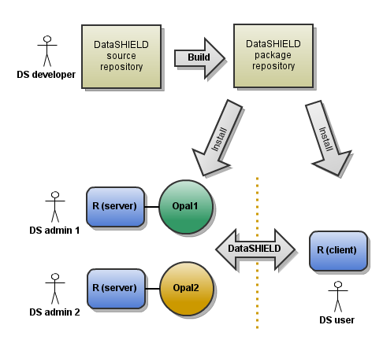



DataSHIELD is under active ongoing development. For the future, the DataSHIELD team aims to develop middleware to actively monitor, scrutinise and interpret all incoming and outgoing information flows and will block and identify/record any request, or series of requests, that might – either by accident or by design – generate potentially disclosive information. In the short term, however, before such middleware is available, it is recommended that additional security might be achieved by having one or more statisticians from the participating studies maintaining regular contact with the primary statistician at the analysis centre so that the progress of the analysis can be monitored.

In addition, it is recommended that DataSHIELD should be implemented with a number of important safeguards in place:

* The need (or not) to seek ethical approval to use DataSHIELD should be explored with the ethical and/or other governance committees that oversee the collaborating studies

* All participating scientists and statisticians should sign a formal confidentiality agreement that guarantees that they will not misuse DataSHIELD by trying to identify any participant in the collaborating studies or to assign a value to a specific variable in any participant.

* All information passed to and from the data computer (DC) at each study should be permanently recorded (at the DC). This will mean that in the unlikely event that a breach of security should occur – either by accident or by design – it can be identified and/or investigated post hoc.
* No new class of model should be fitted using DataSHIELD until the information content of its summary statistics has been comprehensively explored and is thoroughly understood.

* From a scientific perspective, any data to be pooled under DataSHIELD must be adequately harmonized([Fortier et al., 2010](/references)) so that a pooled analysis is both valid and meaningful.

## DataSHIELD Documentation

You are:

* A DataSHIELD user, in charge of performing distributed statistical analysis using DataSHIELD <a href="users.html" class="btn btn-primary">DataSHIELD Users Documentation</a>
* A DataSHIELD administrator, responsible for DataSHIELD deployment in your organization <a href="administrators.html" class="btn btn-primary">DataSHIELD Administrators Documentation</a>
* A DataSHIELD developer, willing to contribute to DataSHIELD code<a href="developers.html" class="btn btn-primary">DataSHIELD Developers Documentation</a>

