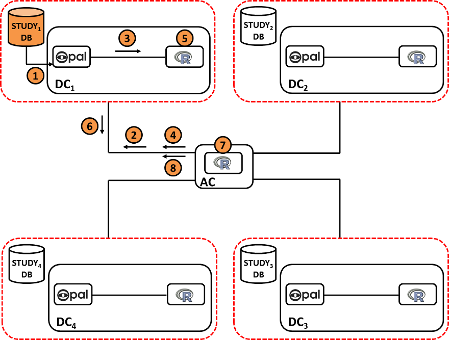



Contemporary investigation of the biomedical and social determinants of health and disease often demands analyses that are based on many thousands of subjects. The number of subjects required regularly exceeds the number that can be provided by any single study. Analysis must then be pooled across several studies. But, a range of practical or ethico-legal/governance considerations (see table 1) can prohibit or discourage the physical sharing of individual-level data with third parties ([Wallace et al., 2008](/references)) – even with designated research collaborators. This presents an important challenge because, from a scientific perspective, methods that work directly with the individual-level data are markedly more flexible, and often more efficient, than other approaches to pooled analysis. DataSHIELD ([Wolfson et al., 2010](/references), [Jones et al., 2012](/references), [Jones et al., 2013](/references), [Murtagh et al., 2012](/references)) is a novel method that has specifically been developed to meet this important challenge. It enables a pooled data analysis to be carried out across several collaborating studies as if one had full access to all of the data from individual participants that might be needed, but, in reality, these data remain completely secure on their host computer at the home base of the study where they were collected or generated. DataSHIELD therefore permits a fully efficient pooled analysis to be undertaken of biomedical data from several studies, even when ethico-legal or other governance restrictions prohibit the release of individual-level data to third parties.

The figure (above) illustrates the basic IT infrastructure that underpins DataSHIELD; it reflects a hypothetical implementation based on a pooled analysis involving data from six studies. The individual-level data that provide the basis of the analysis remain on ’data computers’ (DCs) at their home bases. An additional computer is identified as the ‘analysis computer’ (AC). This is the computer on which the primary statistician will type the commands to enact and control the pooled analysis.

 

Under DataSHIELD, the analysis is ‘parallelized’. That is, rather than analysing all of the data at once - as in a conventional analysis - the data from each study are analysed separately but contemporaneously. Summary statistics are transmitted between the computers to link together the separate analyses so that, in combination, the parallelized approach is mathematically equivalent to undertaking a single overall analysis. Thus, an analysis using DataSHIELD is equivalent to working with the individual-level data from all of the participants from all of the studies combined, but the information that actually has to be transmitted back and forth between the computers consists of no more than analytic instructions and summary statistics that carry no sensitive information and cannot be used to identify individuals. In other words, no individual-level data ever leave the DC on which they are usually stored and the AC never sees the individual-level data.